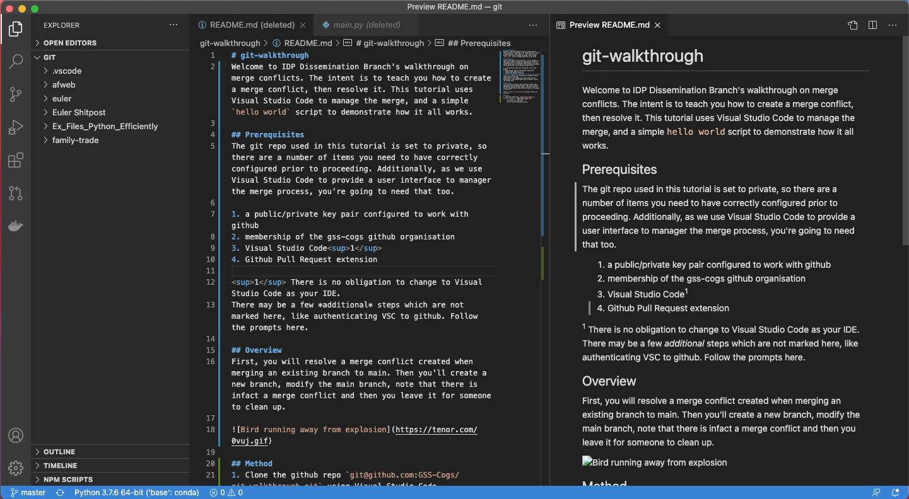
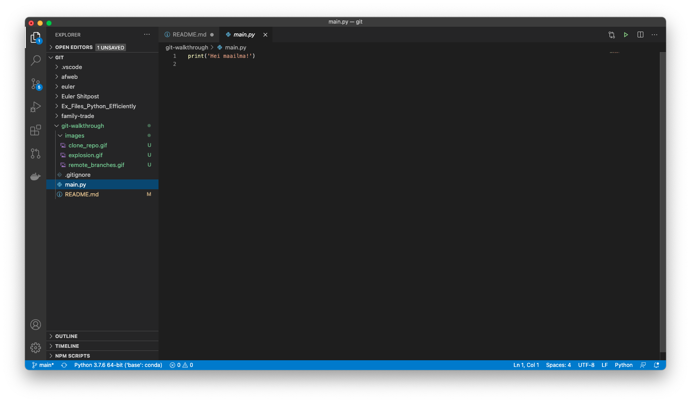

# git-walkthrough
Welcome to IDP Dissemination Branch's walkthrough on merge conflicts. The intent is to teach you how to create a merge conflict, then resolve it. This tutorial uses Visual Studio Code (hereafter VSC) to manage the merge, and a simple `hello world` script to demonstrate how it all works.

## Prerequisites
The git repo used in this tutorial is set to private, so there are a number of items you need to have correctly configured prior to proceeding. Additionally, as we use VSC to provide a user interface to manager the merge process, you're going to need that too.

1. a public/private key pair configured to work with github
2. membership of the gss-cogs github organisation
3. Visual Studio Code1
4. Github Pull Request extension 

1 There is no obligation to change to VSC as your IDE.
There may be a few *additional* steps which are not noted here, like authenticating VSC to github. Follow the prompts, it's a series of authorisations required.

## Overview of the walkthrough
You will resolve a merge conflict created when merging an existing branch to main. Then you'll create a new branch, modify the main branch, note that there is infact a merge conflict and then you leave it for someone to clean up.

## Method
1. Clone the github repo `git@github.com:GSS-Cogs/git-walkthrough.git` using Visual Studio Code
    - `⌘ + shift + P`, type `clone`, paste/type `git@github.com:GSS-Cogs/git-walkthrough.git` 
    
2. Open `main.py` in Visual Studio Code. In the current example our `hello world` is Finnish. Yours will be different.  
3. Check what branches are there to merge. All you need to do is to click on the branch icon in the bottom right of VSC's window.

Right now there my local `main`, `origin\main`, and `origin\HEAD` are all on the same commit `dc70fcb6`. There is another remote branch `origin\francophone` at `d07252aa`
4. It's the `origin\francophone` branch we will merge. Joy of joys. Let's get that started.