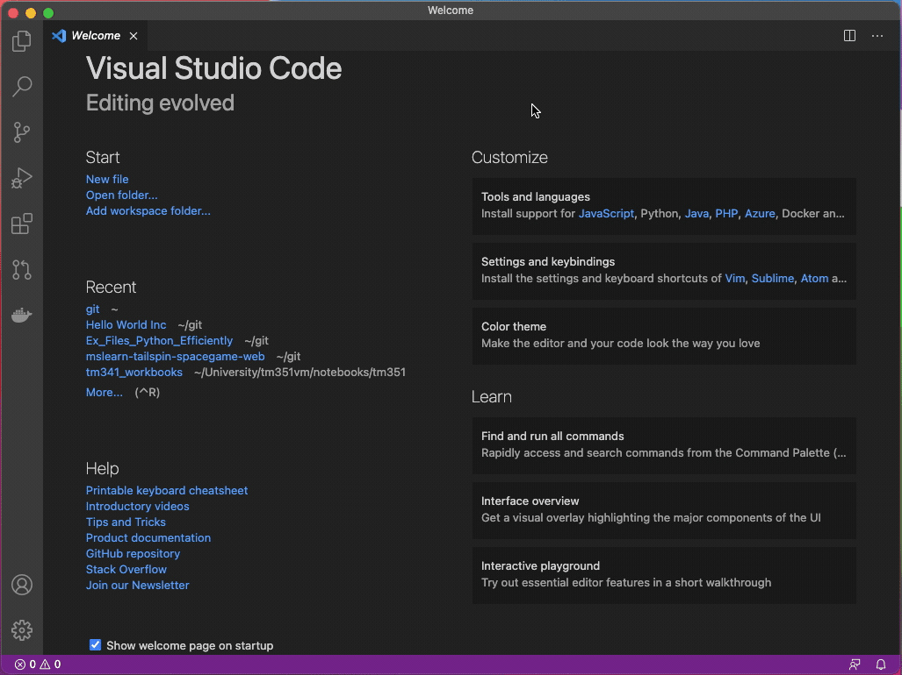

# git-walkthrough
Welcome to IDP Dissemination Branch's walkthrough on merge conflicts. The intent is to teach you how to create a merge conflict, then resolve it. This tutorial uses Visual Studio Code (hereafter VSC) to manage the merge, and a simple `hello world` script to demonstrate how it all works.

## Prerequisites
The git repo used in this tutorial is set to private, so there are a number of items you need to have correctly configured prior to proceeding. Additionally, as we use VSC to provide a user interface to manager the merge process, you're going to need that too.

1. a public/private key pair configured to work with github
2. membership of the gss-cogs github organisation
3. Visual Studio Code1
4. Github Pull Request extension 

1 There is no obligation to change to VSC as your IDE.
There may be a few *additional* steps which are not noted here, like authenticating VSC to github. Follow the prompts, it's a series of authorisations required.

## Overview of the walkthrough
You will resolve a merge conflict created when merging an existing branch to main. Then you'll create a new branch, modify the main branch, note that there is infact a merge conflict and then you leave it for someone to clean up.

*Many of the commands are issued from the Command Pallet, open it using the keystroke `⌘ + shift + P`.*

## Method: The Merge
0. Fork the github repo using the website. From (httpshttps://github.com/GSS-Cogs/git-walkthrough), click on 'Fork' in the upper right corner. You'll save it to your local account, and use the url you genernated below.

1. Clone the github repo `git@github.com:[username]/git-walkthrough.git` using Visual Studio Code
    - Command Pallet: `git: clone`, paste/type `git@github.com:GSS-Cogs/git-walkthrough.git` 
    
    - You can explore the repo, and its current branches at (https://github.com/GSS-Cogs/git-walkthrough)
2. Open `main.py` in Visual Studio Code. In the current example our `hello world` is `Hi World`. Yours will be different. 
3. Check what branches are there to merge with a click on the branch icon in the bottom right of VSC's window.

Right now there my local `main`, `origin\main`, and `origin\HEAD` are all on the same commit ID. There is another remote branch `origin\italian`.
4. It's the `origin\italian` branch we will merge. Joy of joys. Let's get that started.
    - Command Pallet: `Git: merge branch`, then select the repo, then the branch you want to merge *from*
    - Disaster! We now have a merge conflict. This is denoted by a violet C in your editor beside the file(s) which have conflicts.
    - But fret not. Unless you've committed conflicting Jupyter Notebooks, python files are fairly straightforward to merge.
    
5. Choose which change(s) to accept. In this case we prefer the more continental 'Ciao mondo' over the trite sounding 'Hi world'.
    - Click 'Accept Incoming Change'.
    - Save the file. `⌘ + S`
    
6. Stage then commit. There are two ways to do this.
    - Command Pallet: type `stage` to select the appropriate stage command, and Command Pallet: type `commit` to commit them. You'll be prompted for a commit message.
    - Or you can use the User Interface like so.
    
7. Pull and Push. There are two ways to do this.
    - Command Pallet: `pull` then again `push`
    - Or from the status bar click the sync icon.
    
8. At this point, *condragulations*. You've successfully managed a merge conflict. Now's the time to to set one up for the next person to run the walkthrough.

## Method: The Conflict Creation
You are not done yet. Time to screw it up all over again. There are no screenshots/GIFs here because the commands are now familiar.

9. Create a new branch using the name of the language you will use, I will use french. Chose another language. Push the branch to origin. (You can't pull a branch that doesn't exist yet.)
    - Command Pallet: `Git: Create branch from` name the branch `french`, have it based off `main`.
    - Command Pallet: `Git: Push`
10. Checkout main. Change the output back to English.
    - Command Pallet: `Git: Checkout` and select `main`.
    - Change the text back to `Hello world!`
    - Save and pull/push
11. Checkout `french`. Change the output to French. Save and pull/push.
12. Finally delete the original branch online at https://github.com/GSS-Cogs/git-walkthrough/branches but not the one you created.
